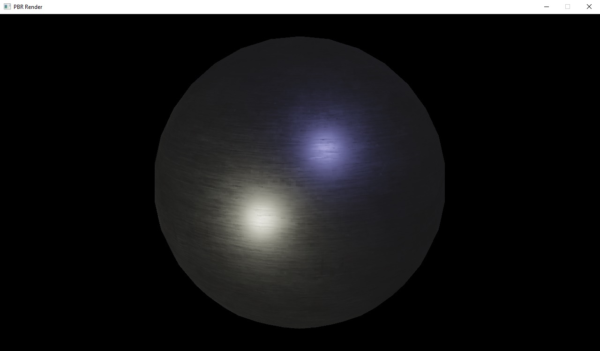
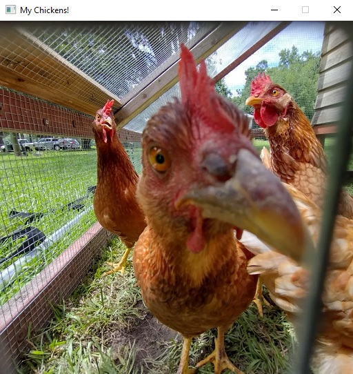

# SoftwareGL (SGL)

This is a 3D graphics library written in C that I developed in highschool for use on very weak microprocessors that lacked SIMD support. This repository is an x86_64 port of the library. It contains improvements over the original, such as a programmable graphics pipeline with shader support.

## Documentation
[Read Here]()

## Demos
Demo programs are available in `demos/`. They use the SDL2 library to view the renders, as SGL is a general purpose rendering library that doesn't contain OS-specific window functionality.

### LoadTexture.c
Introduces the `SGLTex2D` type and how to load images into it. `SGLTex2D` is the core of the library, most functions read or write to it.

### RenderTriangle.c
Introduces the programmable render pipeline. Creates a custom vertex and fragment shader to render a hard coded triangle.

### PBRScene.c
This demo uses the full capabilities of the library to do physically-based rendering (PBR). It demonstrates how to:
* Write vertex shaders to decompress custom model formats.
* Pass custom uniform values to shaders, such as transformation matrices, lights, and textures.
* Export per-vertex attributes from the vertex shader to be interpolated for use in a fragment shader.

## Project Structure
`SGL/` contains the source for the SGL library, which compiles to sgl.DLL. `demos/` contains the sample

## Building
SGL is a general purpose library that can be compiled on any platform, however I have only tested this build setup on Windows.

* `SGL/` contains the source for the library, which compiles to `sgl.DLL` and `sgl.lib`.
* `demos/` contains the source for the demo executables, as well as a copy of the Windows x64 SDL2 library. To compile these on another platform, the CMakeLists.txt will need to be modified to look for the correct platform-specific binaries.

To build on Windows, open `CMakeLists.txt` with Visual Studio. Visual Studio will build to `out/build/x64-_____/bin`, where the SGL DLL, demo executables, and assets will be copied to.